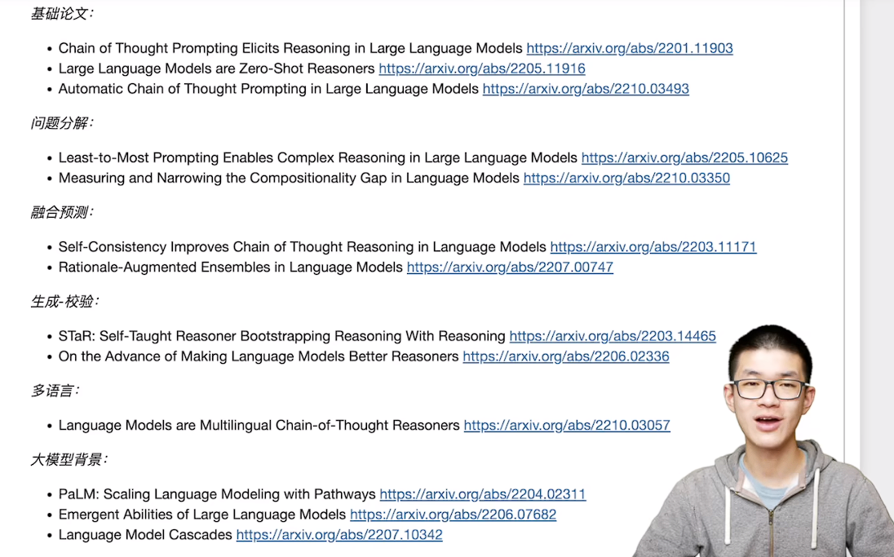
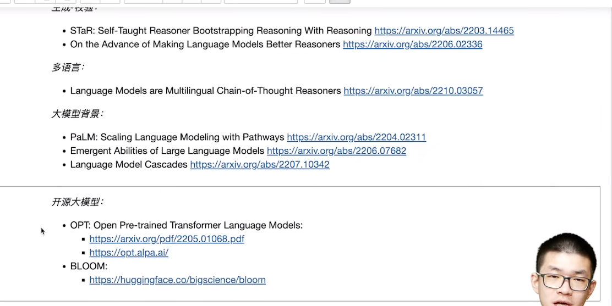
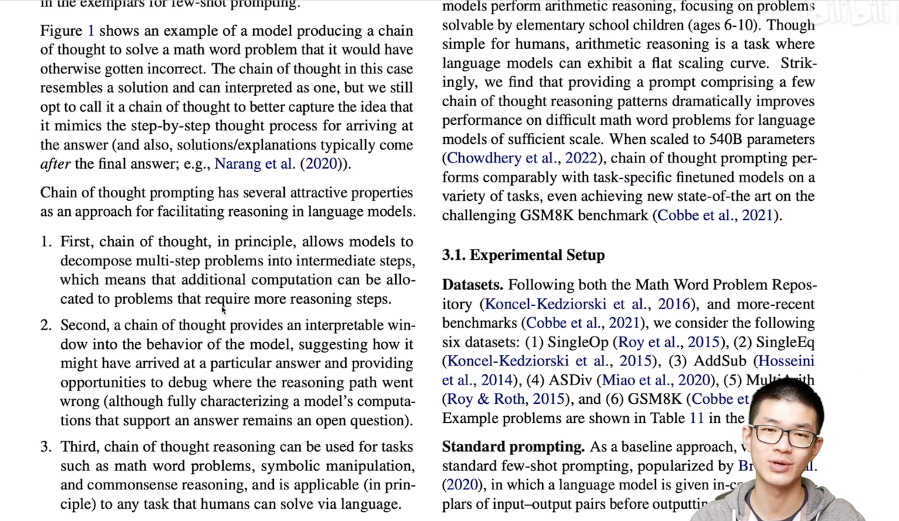

## COT阅读清单



### Zero-shot-CoT 和 Few-shot-CoT 详解

Zero-shot-CoT（Zero-shot Chain-of-Thought）和 Few-shot-CoT（Few-shot Chain-of-Thought）是两种用于自然语言处理任务的提示学习方法。以下是详细解释：

### Zero-shot-CoT

#### 概念
- **Zero-shot-CoT** 在概念上比较简单，但在实现上有一些微妙之处。
- **两次 prompting**：Zero-shot-CoT 需要使用两次提示，这是它与其他方法的主要区别之一。

#### 工作原理
1. **第一次提示**：
   - 目标是以正确的格式引导模型提取答案。
   - 例如，模型在第一次提示后生成一段思考过程（Chain-of-Thought），并以「The answer is」的形式给出答案。
   
2. **第二次提示**：
   - 进一步帮助模型通过再次提示来生成具体的答案。
   - 通过在输入中加入「Let's think step by step」或类似的指示，模型会详细地生成思考过程，并最终得出答案。

#### 优点
- **不需要人为设计示例**：Zero-shot-CoT 不需要为每个任务设计特定的提示示例。
- **灵活性高**：可以应用于不同任务，不需要针对特定任务进行工程设计。

#### 图示解释
- **图 2**：展示了 Zero-shot-CoT 使用两次提示的过程。第一次提示生成思考过程，第二次提示最终得出答案。

### Few-shot-CoT

#### 概念
- **Few-shot-CoT** 需要提供几个示例，这些示例包括任务描述和答案。
- 示例的设计要仔细，确保每个任务都有特定的答案格式。

#### 工作原理
1. **提示设计**：
   - 设计一些包含问题和答案的示例，这些示例明确地展示了思考过程。
   - 示例的结尾通常以「The answer is」的格式来避免额外的答案提取提示。
   
2. **提示输入**：
   - 将这些设计好的示例与新的问题一起输入模型，模型会基于示例生成答案。

#### 优点
- **高效性**：由于提供了明确的示例，模型在理解任务和生成答案时更加高效。
- **准确性**：通过精心设计的示例，模型能够更准确地生成符合预期格式的答案。

#### 图示解释
- **图 1**：
  - **左下角**：展示了零样本基线，直接以「The answer is」的形式提取答案。
  - **右上角**：展示了 Few-shot-CoT，通过设计好的示例来避免对答案提取的额外提示需求。

### 总结
- **Few-shot-CoT** 需要为每个任务设计示例，这些示例包含问题和答案，以便模型学习如何生成正确格式的答案。
- **Zero-shot-CoT** 不需要设计示例，但需要两次提示来引导模型生成思考过程并得出答案。这使得它更灵活，但在实现上需要更多步骤来确保模型能正确理解和回答问题。

通过以上解释，可以更好地理解 Zero-shot-CoT 和 Few-shot-CoT 的工作原理和区别，以及它们在不同任务中的应用场景。

---

### 举例解释 Zero-shot-CoT 和 Few-shot-CoT

为了更好地理解 Zero-shot-CoT 和 Few-shot-CoT 的概念和实现，我们用具体的例子来说明。

### Few-shot-CoT 示例

#### 任务：基本算术题
假设我们要解决一些基本的算术问题，例如加法和减法。我们使用 Few-shot-CoT 来引导模型进行推理和计算。

#### 示例提示设计
我们提供几个示例问题和对应的答案，这些示例展示了如何逐步推理并得出答案。

**示例提示**：
```
Q1: What is 2 + 3?
A1: Let's think step by step. First, we take 2 and add 3 to it. The result is 5. The answer is 5.

Q2: What is 7 - 4?
A2: Let's think step by step. First, we take 7 and subtract 4 from it. The result is 3. The answer is 3.

Q3: What is 6 + 8?
A3: Let's think step by step. First, we take 6 and add 8 to it. The result is 14. The answer is 14.
```

#### 提示输入
```
Q: What is 5 + 7?
```

#### 模型生成答案
```
A: Let's think step by step. First, we take 5 and add 7 to it. The result is 12. The answer is 12.
```

通过这些示例，模型学习到了如何逐步进行算术运算，并按照指定的格式生成答案。

### Zero-shot-CoT 示例

#### 任务：基本算术题
同样是解决基本的算术问题，但这次使用 Zero-shot-CoT 方法。

#### 第一次提示
**输入**：
```
Q: What is 5 + 7?
Let's think step by step.
```

#### 模型生成的思考过程
```
A: First, we take 5 and add 7 to it. The result is 12.
```

#### 第二次提示
**输入**：
```
Q: What is 5 + 7?
Let's think step by step.
First, we take 5 and add 7 to it. The result is 12.
The answer is
```

#### 模型生成的最终答案
```
12
```

### 总结
- **Few-shot-CoT** 通过提供示例问题和答案，明确展示了如何逐步推理并得出答案，模型可以直接参考这些示例进行推理。
- **Zero-shot-CoT** 则通过两次提示引导模型。第一次提示生成一个思考过程，第二次提示进一步完善并得出最终答案。

这两种方法各有优缺点：
- **Few-shot-CoT** 需要人为设计多个示例，适合在有类似示例的情况下使用。
- **Zero-shot-CoT** 不需要设计示例，更加灵活，但需要两次提示来确保模型生成正确的答案。


---
### Zero-shot-CoT 的工作机制

Zero-shot-CoT（Zero-shot Chain-of-Thought）通过两次提示（prompt）来引导模型进行推理和回答问题。具体步骤如下：

### 第一次提示：推理提取

1. **模板创建**：
   - 使用一个简单的模板将输入问题 \(X\) 修改为一个提示（prompt）。
   - 模板格式为：「Q: [X]. A: [T]」，其中：
     - \(X\) 是输入问题。
     - \(T\) 是触发思维链的句子，例如「Let’s think step by step」。
   - 最终的提示变为：「Q: [X]. A: Let’s think step by step.」

2. **生成推理过程**：
   - 将处理后的文本 \(X'\) 输入到语言模型中，生成后续的推理过程句子 \(Z\)。
   - 例如，给定问题「What is 5 + 7?」，提示变为「Q: What is 5 + 7? A: Let’s think step by step.」，模型生成的推理过程可能是「First, we take 5 and add 7 to it. The result is 12.」。

3. **解码策略**：
   - 为了简化，研究者使用贪婪解码策略（即每次选择概率最高的词）来生成推理过程 \(Z\)。

### 第二次提示：答案提取

1. **构建答案提取提示**：
   - 将第一次生成的推理过程 \(Z\) 和被加工的文本 \(X'\) 结合起来，构建新的提示来提取最终答案。
   - 提示格式为：[X'] [Z] [A]：
     - [X'] 是第一个提示 \(X'\)。
     - [Z] 是第一步生成的推理过程。
     - [A] 是用于提取答案的触发句，根据不同任务有不同的触发句。
   - 例如，对于数学问题，触发句可以是「Therefore, the answer (arabic numerals) is」。

2. **生成最终答案**：
   - 将构建的提示输入到语言模型中，生成最终的答案句子 \(Y\) 并解析出答案。
   - 例如，给定生成的推理过程「First, we take 5 and add 7 to it. The result is 12.」，提示变为「Q: What is 5 + 7? A: Let’s think step by step. First, we take 5 and add 7 to it. The result is 12. Therefore, the answer (arabic numerals) is.」，模型生成的最终答案可能是「12」。

### 举例说明

假设我们有一个数学问题「What is 5 + 7?」。

#### 第一次提示：推理提取

- **输入问题**：What is 5 + 7?
- **第一次提示**：Q: What is 5 + 7? A: Let’s think step by step.
- **生成的推理过程**：First, we take 5 and add 7 to it. The result is 12.

#### 第二次提示：答案提取

- **构建提示**：Q: What is 5 + 7? A: Let’s think step by step. First, we take 5 and add 7 to it. The result is 12. Therefore, the answer (arabic numerals) is.
- **生成最终答案**：12

### 总结

Zero-shot-CoT 通过两次提示引导模型进行推理和答案提取：
1. **第一次提示**：通过触发思维链生成详细的推理过程。
2. **第二次提示**：结合第一次生成的推理过程，再次引导模型提取最终答案。

这种方法不需要人为设计示例，但需要两次提示来确保模型能够正确地生成和提取答案。

----
### Chain-of-Thought (CoT) 和 Plan-and-Think (PoT) 的详细解释

在自然语言处理（NLP）和人工智能（AI）领域，Chain-of-Thought (CoT) 和 Plan-and-Think (PoT) 是两种用于增强模型推理和生成能力的方法。它们的目标是通过模拟人类的思维过程，使模型在复杂任务中表现得更加智能和连贯。

### Chain-of-Thought (CoT)

#### 概念
Chain-of-Thought (CoT) 是一种方法，通过引导模型在生成答案前逐步思考，从而提高模型在复杂任务上的表现。CoT 的核心思想是模拟人类的逐步推理过程，让模型能够通过一系列逻辑步骤得出结论。

#### 特点
- **逐步推理**：CoT 模型在回答问题时会逐步展开思维过程，从而形成一个逻辑链条。
- **透明性**：这种方法使模型的推理过程更加透明和可解释。
- **应用场景**：适用于需要多步推理和复杂逻辑推断的任务，如数学问题、推理题和问答系统。

#### 示例
假设有一个数学问题：
```
问题：如果一个人每天节省10元，一个月能节省多少钱？
```
使用 CoT 方法的模型可能会这样推理：
```
步骤 1：一个月有30天。
步骤 2：每天节省10元。
步骤 3：一个月节省的钱等于每天节省的钱乘以天数。
步骤 4：10元/天 * 30天 = 300元。
答案：一个月能节省300元。
```

### Plan-and-Think (PoT)

#### 概念
Plan-and-Think (PoT) 是一种增强模型思维过程的方法，通过让模型先制定一个计划，然后根据计划进行逐步推理和生成。PoT 的核心思想是先规划（Plan），再思考（Think），使模型在生成复杂内容时更加有条理和连贯。

#### 特点
- **规划阶段**：模型首先生成一个大致的计划，确定解决问题的步骤或大纲。
- **思考阶段**：根据规划逐步展开详细推理和生成内容。
- **结构化思维**：这种方法使模型的思维过程更加结构化，有助于解决复杂问题。
- **应用场景**：适用于需要详细步骤和逻辑推理的生成任务，如文章写作、复杂问答和多步决策任务。

#### 示例
假设有一个复杂的问题：
```
问题：请写一篇关于气候变化影响的文章。
```
使用 PoT 方法的模型可能会先规划，再展开具体内容：
```
规划阶段：
1. 介绍气候变化。
2. 描述气候变化的原因。
3. 讨论气候变化的影响。
4. 提出应对气候变化的措施。

思考阶段：
段落 1：气候变化是指长期的气候模式的变化，通常由于人类活动导致的温室气体排放增加。
段落 2：主要原因包括化石燃料的燃烧、森林砍伐和工业活动。
段落 3：气候变化的影响包括全球变暖、海平面上升和极端天气事件的增加。
段落 4：应对措施包括减少温室气体排放、发展可再生能源和增强国际合作。
```

### CoT 和 PoT 的区别

- **推理过程**：
  - **CoT**：强调逐步推理，通过一步步展开思维链条来解决问题。
  - **PoT**：先制定一个总体计划，然后根据计划展开详细推理和生成。

- **应用场景**：
  - **CoT**：适用于需要逐步推理的任务，如数学问题和逻辑推断。
  - **PoT**：适用于需要结构化思维和详细步骤的生成任务，如文章写作和复杂问答。

### 总结

Chain-of-Thought (CoT) 和 Plan-and-Think (PoT) 是两种用于增强模型推理和生成能力的方法。CoT 通过逐步推理来提高模型的推理能力，而 PoT 则通过先规划再思考的方式，使模型在复杂任务中表现得更加有条理和连贯。它们在不同的应用场景中各有优势，通过合理使用，可以显著提升模型在处理复杂任务时的表现。

---

### Program of Thought (PoT)

**Program of Thought (PoT)** 是一种更高级的思维模拟方法，它结合了编程和逻辑推理的元素，使得 AI 模型在处理复杂问题时能够像程序员一样思考和解决问题。PoT 方法使得模型不仅能够进行逐步推理，还能够构建和执行复杂的思维过程，类似于编写和执行程序。

#### 概念

- **程序化思维**：PoT 方法通过引导模型模拟编程过程，使得模型能够像程序员一样进行思考和解决问题。
- **模块化**：思维过程被分解为不同的模块，每个模块对应具体的步骤或逻辑单元。
- **动态执行**：模型能够动态地构建和执行思维过程，类似于运行代码。

#### 特点

- **灵活性**：PoT 方法使得模型能够灵活地应对各种复杂任务，通过动态构建和调整思维过程。
- **模块化设计**：通过将思维过程分解为多个模块，模型能够更好地组织和管理复杂的推理任务。
- **高效推理**：利用程序化思维，模型能够在处理复杂任务时更加高效和准确。

#### 示例

假设有一个复杂的数学问题：
```
问题：编写一个程序计算斐波那契数列的第 n 项。
```
使用 PoT 方法的模型可能会这样思考和解决问题：

1. **规划阶段**：
   - 1.1 定义问题：计算斐波那契数列的第 n 项。
   - 1.2 确定方法：递归或迭代。

2. **编程阶段**：
   - 2.1 编写递归函数：
     ```python
     def fibonacci(n):
         if n <= 1:
             return n
         else:
             return fibonacci(n-1) + fibonacci(n-2)
     ```
   - 2.2 编写迭代函数：
     ```python
     def fibonacci_iter(n):
         a, b = 0, 1
         for _ in range(n):
             a, b = b, a + b
         return a
     ```

3. **执行阶段**：
   - 3.1 选择方法并执行：
     ```python
     n = 10  # 计算第10项
     result = fibonacci_iter(n)
     print(result)  # 输出结果
     ```

#### 应用场景

- **编程问题**：处理需要编写和执行代码的任务，如自动代码生成和代码调试。
- **复杂推理**：需要多步骤、多模块的逻辑推理任务，如科学研究和工程设计。
- **动态调整**：需要在解决过程中动态调整思维过程的任务，如实时决策和自适应系统。

### CoT、Plan-and-Think 和 Program of Thought 的对比

- **Chain-of-Thought (CoT)**：
  - **方法**：逐步推理。
  - **特点**：透明性和可解释性。
  - **应用场景**：数学问题、逻辑推断、简单问答。

- **Plan-and-Think (PoT)**：
  - **方法**：先规划后思考。
  - **特点**：结构化思维。
  - **应用场景**：文章写作、复杂问答、多步决策。

- **Program of Thought (PoT)**：
  - **方法**：程序化思维。
  - **特点**：灵活性和模块化。
  - **应用场景**：编程问题、复杂推理、动态调整。

### 总结

Program of Thought (PoT) 是一种将编程和逻辑推理结合起来的方法，使得 AI 模型能够像程序员一样进行复杂的思考和解决问题。通过程序化思维和模块化设计，PoT 方法使得模型在处理复杂任务时能够更加灵活和高效。与 CoT 和 Plan-and-Think 方法相比，PoT 更加注重动态构建和执行思维过程，适用于需要编程和复杂逻辑推理的任务。

---


### PoT少样本编程 (TMLR) 详细解释

图中展示了 "Program of Thought" (PoT) 和 "Chain of Thought" (CoT) 两种方法在处理两个问题时的表现对比。PoT 方法通过编程解决问题，而 CoT 方法通过逐步推理解决问题。图中的示例展示了 PoT 方法在复杂计算任务中的优势。

#### 问题1: 斐波那契数列的第50项
```
Question: In Fibonacci sequence, it follows the rule that each number is equal to the sum of the preceding two numbers. Assuming the first two numbers are 0 and 1, what is the 50th number in Fibonacci sequence?
```

**CoT 方法**：
- CoT 逐步推导斐波那契数列的每一项，展示了前几项的计算过程。
- 问题在于，这种手动推导在处理大项数时效率低下，容易出错。
- 最终，错误地得出第50项是32,432,268,459。

**PoT 方法**：
- PoT 通过编程计算斐波那契数列的第50项。
- 使用Python编写程序来计算斐波那契数列，设置数组长度为50，并通过循环计算每一项。
- 最终，正确地得出第50项是12,586,269,025。
- 代码示例：
  ```python
  length_of_fibonacci_sequence = 50
  fibonacci_sequence = np.zeros(length_of_fibonacci_sequence)
  fibonacci_sequence[0] = 0
  fibonacci_sequence[1] = 1
  for i in range(3, length_of_fibonacci_sequence):
      fibonacci_sequence[i] = fibonacci_sequence[i-1] + fibonacci_sequence[i-2]
  ans = fibonacci_sequence[-1]
  ```

#### 问题2: 计算复利利率
```
Question: Ketty saves 20000 dollars to the bank. After three years, the sum with compound interest rate is 1000 dollars more than the sum with simple interest rate. What is the interest rate of the bank?
```

**CoT 方法**：
- CoT 通过手动推导计算复利和单利的总和，展示了详细的计算步骤。
- 然而，手动计算中出现了代数错误，最终错误地得出利率为-0.051333。

**PoT 方法**：
- PoT 通过编程计算复利和单利的总和，并求解利率。
- 使用SymPy库编写程序来符号计算和求解代数方程。
- 最终，正确地得出利率为0.24814。
- 代码示例：
  ```python
  from sympy import symbols, Eq, solve
  
  interest_rate = symbols('x')
  sum_in_two_years_with_simple_interest = 20000 + 20000 * 3 * interest_rate
  sum_in_two_years_with_compound_interest = 20000 * (1 + interest_rate)**3
  eq = Eq(sum_in_two_years_with_compound_interest, sum_in_two_years_with_simple_interest + 1000)
  ans = solve(eq, interest_rate)
  ```

### 总结

1. **CoT (Chain of Thought)**：
   - **方法**：逐步推理，展示每一步的思考过程。
   - **优点**：适合简单的逻辑推理和小规模计算任务。
   - **缺点**：在处理复杂计算和大规模问题时容易出错，效率低下。

2. **PoT (Program of Thought)**：
   - **方法**：通过编程解决问题，将问题转化为程序代码来计算。
   - **优点**：适合复杂计算任务，利用编程语言和库提高计算准确性和效率。
   - **缺点**：需要编写和调试代码，初学者可能不熟悉编程方法。

### 实际应用
- **斐波那契数列问题**：使用编程方法（PoT）可以有效解决大规模计算问题，而逐步推理（CoT）容易出错。
- **复利利率问题**：使用符号计算库（如SymPy）的编程方法（PoT）可以准确求解复杂代数方程，而手动推理（CoT）可能因计算错误导致结果不准确。

通过以上对比，可以看到在处理复杂计算任务时，PoT 方法比 CoT 方法更为高效和准确。

---

自治性提升推理结果的方法是一种通过设置生成参数来提高模型推理准确性的方法。这里详细解释这种方法的步骤和原理。

### 自治性提升推理结果的方法步骤

1. **设置 Temperature 参数**：
   - **Temperature** 是控制生成文本随机性的参数。Temperature 的值越高，生成的文本越随机；Temperature 的值越低，生成的文本越确定。
   - 例如，设置 Temperature 为 0.7，会比设置为 0.0（确定性生成）产生更多样化的输出。这是因为较高的 Temperature 允许模型在选择下一个词时考虑更多可能性，而不是只选择概率最高的词。

2. **保持同样的输入，多次采样**：
   - 通过保持输入不变，进行多次生成，来得到多个不同的推理路径和答案。
   - 每次生成过程中，由于 Temperature 参数的设置，模型会探索不同的推理路径，从而得到不同的答案。
   - 多次采样可以理解为让模型针对同一个问题多次“思考”，每次都可能走不同的思维路径。

3. **生成多个推理路径和答案**：
   - 每次生成都会输出一个完整的推理路径和相应的答案。
   - 例如，如果生成 5 次，可能会得到 5 个不同的推理路径和相应的答案。

4. **选择最常见答案**：
   - 将所有生成的推理路径和答案进行汇总，统计每个答案出现的次数。
   - 最终选择出现次数最多的答案作为最终输出，这种方法确保了答案的自洽性（self-consistency）。
   - 通过多次采样和汇总，可以减少单一生成过程中的随机错误，提升最终答案的可靠性和准确性。

### 示例详解

假设有一个问题：`Janet's ducks lay 16 eggs per day. She sells the remainder for $2 per egg. If she bakes muffins for her friends every day with four eggs, how much does she make every day?`

#### 步骤1：设置 Temperature 参数

将 Temperature 设置为 0.7，这样可以使生成过程产生更多样化的输出。

#### 步骤2：保持输入不变，多次采样

使用相同的输入问题，多次生成推理路径和答案，例如生成 3 次：

- 生成1：
  - 推理路径：16 - 4 = 12，12 * $2 = $24
  - 答案：$24
- 生成2：
  - 推理路径：16 - 4 = 12，12 * $1.5 = $18
  - 答案：$18
- 生成3：
  - 推理路径：16 - 4 = 12，12 * $2 = $24
  - 答案：$24

#### 步骤3：生成多个推理路径和答案

- 生成1：答案 $24
- 生成2：答案 $18
- 生成3：答案 $24

#### 步骤4：选择最常见答案

统计每个答案出现的次数：
- $24 出现了 2 次
- $18 出现了 1 次

选择出现次数最多的答案 $24 作为最终答案。

### 优势和应用

- **优势**：
  - 减少了生成过程中的随机错误，通过多次采样和汇总提高答案的可靠性。
  - 提升了模型在复杂推理任务中的表现，确保答案的自洽性。

- **应用**：
  - 可以应用于复杂的逻辑推理和计算任务，如数学问题、逻辑题等。
  - 适用于需要高准确性和可靠性的场景，如医学诊断、法律推理等。

通过这种自治性提升推理结果的方法，可以有效提高模型在处理复杂问题时的准确性和稳定性。